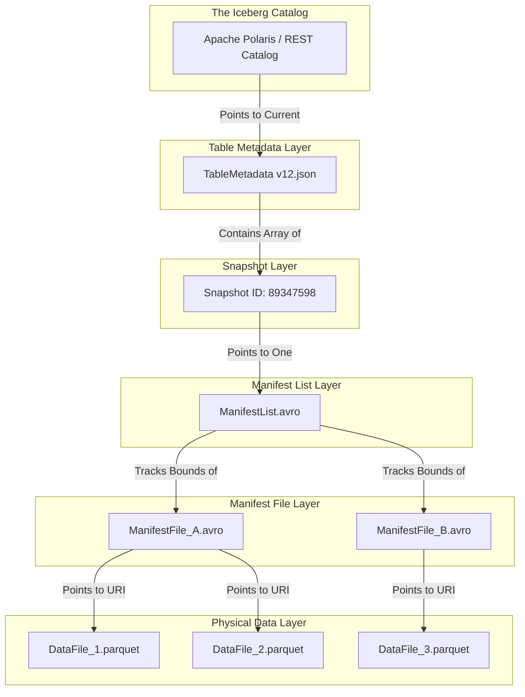

# Apache Iceberg Architecture

To truly master the Open Data Lakehouse, a data engineer must move beyond high-level definitions and understand the absolute, unyielding mathematical structure of the Apache Iceberg architecture. Iceberg is not a file format; it is an incredibly complex, highly deterministic metadata tracking protocol designed to enforce strict ACID database constraints on top of highly eventual, chaotic object storage systems like Amazon S3. 

The entire architecture is designed to solve one massive computer science problem: How do you allow 50 distributed servers to simultaneously read and write to a single massive dataset without corrupting the files or slowing down the query? Iceberg achieves this through a rigid, hierarchical Metadata Tree and a strict implementation of Optimistic Concurrency Control.

## The Metadata Tree Hierarchy

The physical files of an Iceberg table reside entirely in object storage. They are organized in a strict top-down hierarchy.

### Level 1: The Iceberg Catalog
The Catalog is the absolute source of truth. When Apache Spark wants to read a table named `sales_data`, it asks the Catalog. The Catalog is essentially a highly fast, transactional Key-Value store (like Apache Polaris, AWS Glue, or Nessie). Its sole mathematical purpose is to store a single pointer: the exact S3 URI of the *current* Table Metadata JSON file.

### Level 2: The Table Metadata JSON
The Catalog hands Spark a string: `s3://bucket/metadata/v12.json`. 
Spark downloads this JSON file. This file contains the entire historical DNA of the table. It explicitly lists the current schema, the partition specification (e.g., `days(timestamp)`), and an array of all Historical Snapshots. Spark looks at the JSON, identifies the ID of the *Current Snapshot*, and reads its corresponding pointer.

### Level 3: The Snapshot and Manifest List
The Snapshot points to exactly one Manifest List (an Avro file). 
The Manifest List is an index of Manifests. It contains a row for every single Manifest File that belongs to this specific snapshot. Crucially, the Manifest List stores the absolute upper and lower boundaries of the data contained in those manifests. If the query is filtering for the year 2026, and the Manifest List indicates that a specific Manifest File only contains 2024 data, the engine drops that Manifest File instantly from active memory.

### Level 4: The Manifest Files
The remaining Manifest Files (also Avro files) are downloaded. These files contain the actual, physical S3 URI paths to the underlying Apache Parquet data files. They track exactly how many rows are in the Parquet file and the Min/Max statistics for every single column in that file.

## The Commit Flow and Concurrency

When a massive data engineering pipeline attempts to update a table, it must do so without breaking the queries of analysts who are currently reading the table. Iceberg achieves this via Snapshot Isolation.

1. **The Read Phase:** The analyst executes a query. They read `v12.json` and its associated snapshots. They are mathematically isolated in the past.
2. **The Write Phase:** The data pipeline (Spark) writes new Parquet data files to S3. It then generates new Manifest Files, a new Manifest List, and a brand new `v13.json` metadata file.
3. **The Commit Phase:** Spark sends a request to the Catalog: "Please swap the table pointer from `v12.json` to `v13.json`." 
4. **Optimistic Concurrency Control:** The Catalog checks the state. If no one else has updated the table, the swap is instantaneous and atomic. If another pipeline successfully committed `v13.json` a millisecond earlier, the Catalog rejects Spark's request. Spark must autonomously download the new `v13.json`, re-evaluate its metadata tree, generate a `v14.json`, and try the commit again.

This architectural rigidity is the absolute reason Apache Iceberg is completely trusted by massive Fortune 500 enterprises to handle petabyte-scale transactional workloads.

## Learn More
To learn more about the Data Lakehouse, read the book "Lakehouse for Everyone" by Alex Merced. You can find this and other books by Alex Merced at [books.alexmerced.com](https://books.alexmerced.com).
