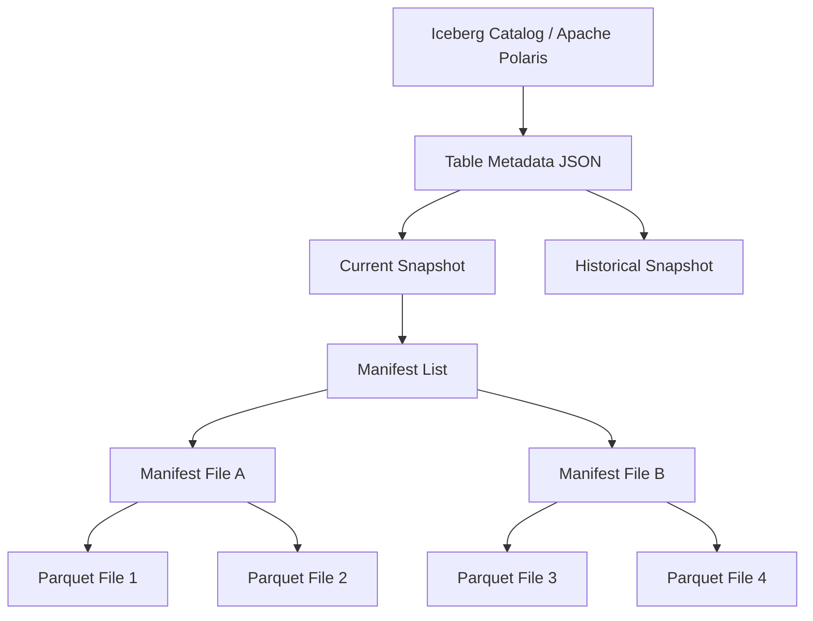

# Apache Iceberg Explained

Apache Iceberg is the world's most advanced, high-performance Open Table Format. Originally developed at Netflix to solve the catastrophic performance bottlenecks of the legacy Apache Hive Metastore, Iceberg has rapidly become the absolute de facto standard for building a modern Open Data Lakehouse. At its core, Iceberg is an incredibly complex metadata tracking system. It does not replace the underlying storage (like Amazon S3 or Apache Parquet files), and it does not execute SQL queries (like Dremio or Apache Spark). Instead, Iceberg acts as the strict, mathematical ledger sitting perfectly between the storage and the compute, guaranteeing absolute ACID transactional consistency across petabytes of chaotic object storage data.

Before Iceberg, the Hadoop ecosystem relied on "Directory-Based" tracking. If a database had 10 million files, the Hive Metastore tracked them by their physical S3 folder paths. When a query engine executed a `SELECT` statement, it was forced to execute an `s3://list()` command to find the files, a process that could literally take thirty minutes before the query even began. Iceberg completely destroys this bottleneck by tracking data at the *file level* rather than the directory level, transforming a 30-minute list operation into a 3-millisecond metadata lookup.

## The Architecture of File-Level Tracking

Iceberg's ability to provide sub-second query planning over massive datasets relies entirely on its strict, hierarchical metadata tree.

### 1. The Table Metadata File
When a compute engine connects to an Iceberg table, it first asks the Catalog for the physical location of the current Table Metadata file (a JSON file). This file contains the absolute truth about the table: the schema, the partitioning rules, and a highly structured list of all Historical Snapshots. 

### 2. Snapshots and Manifest Lists
A Snapshot represents the exact, mathematically consistent state of the table at a specific microsecond in time. 
The Snapshot points directly to a single Manifest List (an Avro file). The Manifest List acts as an index of indexes. It contains a list of all Manifest Files, and crucially, it stores the upper and lower mathematical bounds of the data within those Manifest Files (e.g., "Manifest A contains data for the year 2024, Manifest B contains data for 2025").

### 3. Manifest Files and Parquet Data
The Manifest Files (also Avro files) contain the exact, physical S3 URI strings pointing to the individual Apache Parquet data files. Like the Manifest List, the Manifest File also tracks column-level statistics (e.g., "Parquet File 1 contains Customer IDs between 1 and 10,000").

### The Pruning Execution
When an analyst executes `SELECT * FROM sales WHERE year = 2025 AND customer_id = 500`, the query engine does not scan the raw Parquet files. It reads the Manifest List, instantly drops Manifest A (because it only contains 2024 data). It reads Manifest B, evaluates the column statistics, and instantly drops Parquet Files 3 and 4. The engine executes the query by reading exactly one specific Parquet file, achieving massive performance acceleration known as "Metadata Pruning."

## Core Capabilities of Apache Iceberg

### Hidden Partitioning
In legacy Hive systems, changing a partition strategy (e.g., switching from partitioning by Month to partitioning by Day) was a catastrophic engineering event that required completely rewriting the entire multi-terabyte dataset. 
Iceberg utilizes Hidden Partitioning. The mathematical partition logic is stored explicitly in the metadata, entirely abstracted from the physical files. An engineer can execute an `ALTER TABLE` command to change the partition strategy instantly, without moving a single byte of physical data.

### Schema Evolution
Iceberg tracks columns by unique, immutable Integer IDs, not by their string names. 
If a developer renames the column `order_value` to `total_revenue`, the Integer ID remains exactly the same. The engine reads the old Parquet files flawlessly, mapping the new string name to the old data without requiring any massive table rewrites.

### Optimistic Concurrency Control (OCC)
Iceberg guarantees that multiple systems can write to the same table simultaneously. 
When Apache Spark and Apache Flink both attempt to write to the table at the exact same millisecond, they both generate their new metadata trees independently. They then attempt to commit to the Catalog. The Catalog utilizes Optimistic Concurrency Control to mathematically verify if the base snapshot has changed. One writer succeeds; the other writer is forced to retry the operation against the new snapshot, completely preventing data corruption.

## Learn More
To learn more about the Data Lakehouse, read the book "Lakehouse for Everyone" by Alex Merced. You can find this and other books by Alex Merced at [books.alexmerced.com](https://books.alexmerced.com).
