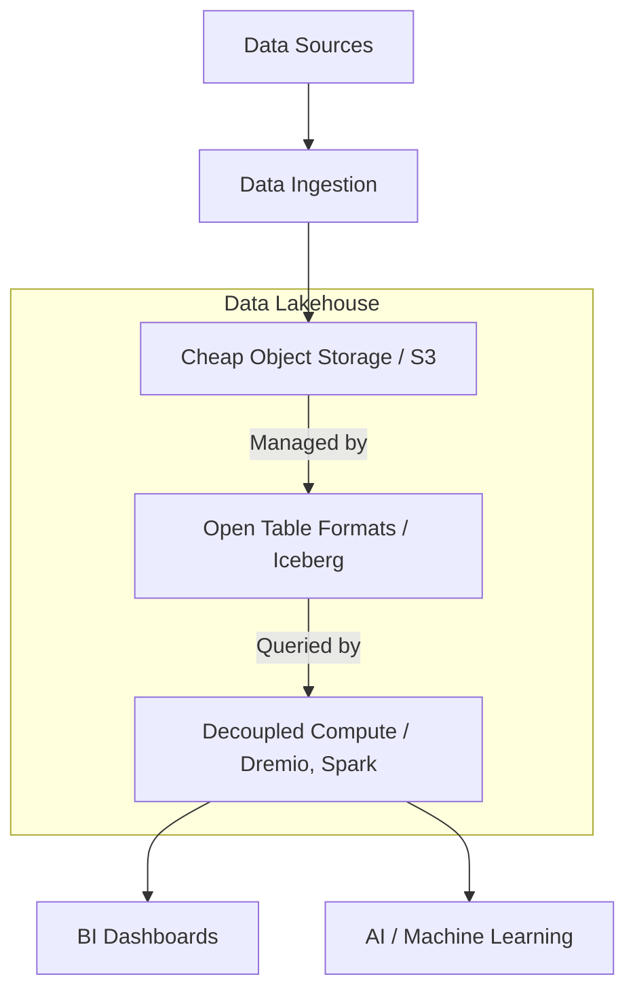

# Data Lakehouse vs Data Lake vs Data Warehouse

To navigate the modern data engineering landscape, an architect must fundamentally understand the massive historical evolution of data storage. The industry has violently swung between three distinct architectural paradigms: the Data Warehouse, the Data Lake, and finally, the Data Lakehouse. Each architecture was invented to solve the catastrophic failures of the previous generation, culminating in the unified, open standards of the modern era.

## 1. The Data Warehouse (The First Generation)

The traditional Enterprise Data Warehouse (like Teradata, Oracle, and later Snowflake or Amazon Redshift) was the absolute standard for business intelligence. 

**The Architecture:**
A Data Warehouse tightly couples Compute and Storage into a single, proprietary black box. Data is stored in highly rigid relational tables. To put data into a Data Warehouse, an engineer must execute heavy ETL (Extract, Transform, Load). The data must be perfectly structured, cleaned, and forced into a strict schema before the database will accept a single byte.

**Strengths:**
* **Extreme Performance:** Because the vendor controls the physical hard drives and the software, queries are blistering fast.
* **ACID Compliance:** Absolute mathematical guarantee of transaction safety.
* **BI Native:** Built entirely to support executive SQL dashboards.

**Catastrophic Failures:**
* **Vendor Lock-in:** You cannot query Snowflake data using an external engine. You must pay Snowflake's compute costs to access your own data.
* **No AI Support:** Machine learning models require massive unstructured data (images, audio, text). A Data Warehouse physically cannot store a JPEG file.
* **Massive Cost:** Storing 50 Petabytes of historical log data in a Data Warehouse is financially ruinous.

## 2. The Data Lake (The Second Generation)

To solve the massive cost and rigidity of the Data Warehouse, the industry invented the Data Lake (powered initially by Hadoop HDFS, and later by Amazon S3 and Azure Data Lake).

**The Architecture:**
A Data Lake is the exact opposite of a Data Warehouse. It is a massive, incredibly cheap, completely unstructured dumping ground. Engineers dump raw JSON, CSV, Parquet, and media files directly into S3 buckets. There is no schema enforcement on write (Schema-on-Read).

**Strengths:**
* **Infinite, Cheap Storage:** Storing 50 Petabytes in S3 costs a fraction of the price of a Data Warehouse.
* **AI/ML Native:** Data scientists can easily access the raw, unstructured data required to train complex machine learning models.

**Catastrophic Failures:**
* **The Data Swamp:** Because there is no schema enforcement and no ACID transactions, the lake rapidly degenerates into a chaotic, unqueryable swamp of corrupted files.
* **No Transactional Integrity:** If a pipeline crashes halfway through a write operation, the lake contains 50% duplicate data. Analysts lose all trust in the numbers.
* **Terrible BI Performance:** Querying billions of raw files using tools like Amazon Athena is incredibly slow, rendering real-time BI dashboards impossible.

## 3. The Data Lakehouse (The Final Synthesis)

The Data Lakehouse was explicitly invented to perfectly synthesize the absolute best characteristics of both previous generations while entirely eliminating their failures.

**The Architecture:**
The Lakehouse utilizes the incredibly cheap, infinitely scalable object storage of the Data Lake (Amazon S3), but it layers highly complex **Open Table Formats** (Apache Iceberg, Delta Lake) on top of the raw files. This metadata layer physically brings the ACID transactions, schema enforcement, and sub-second performance of the Data Warehouse directly to the Data Lake.

**Strengths:**
* **Zero Vendor Lock-In:** Data is stored in open Apache Parquet files. If a vendor raises their compute prices, you simply point a different open-source query engine at the exact same data.
* **Unified Workloads:** Data Scientists (training AI) and Business Analysts (running BI SQL) hit the exact same, mathematically verified Iceberg tables simultaneously.
* **Cost Efficiency:** You pay S3 prices for storage, and you only pay for Compute when you actively execute a query.

## The Architectural Decision

If an organization is small, deals only in highly structured financial data, and has no interest in Artificial Intelligence, a Cloud Data Warehouse remains a simple, effective choice. 

However, if an organization is scaling to petabytes of data, requires the agility to test new distributed query engines, and demands the ability to train complex AI models against governed, transactional data, the legacy Data Lake and Data Warehouse are obsolete. The **Open Data Lakehouse** is the mandatory, future-proof architectural foundation.

## Learn More
To learn more about the Data Lakehouse, read the book "Lakehouse for Everyone" by Alex Merced. You can find this and other books by Alex Merced at [books.alexmerced.com](https://books.alexmerced.com).
