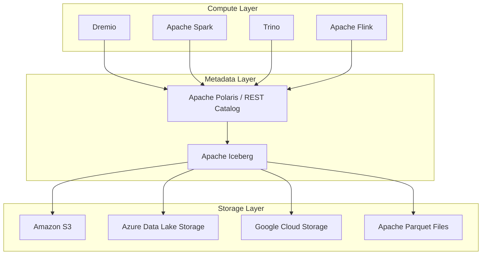

# What Is a Data Lakehouse?

The Data Lakehouse is a massive paradigm shift in enterprise data architecture that fundamentally resolves the historical tension between the rigid, highly performant Cloud Data Warehouse and the chaotic, cheap, but unmanageable Data Lake. By combining the absolute flexibility and low-cost object storage of a Data Lake with the strict ACID transactions, complex metadata management, and sub-second analytical performance of a Data Warehouse, the Data Lakehouse provides a single, unified foundation for both traditional Business Intelligence (BI) and advanced Artificial Intelligence (AI) workloads.

Historically, organizations were forced into a catastrophic bifurcated architecture (the Lambda or Kappa architectures). They would store all of their raw, unstructured data (images, logs, text) in an Amazon S3 Data Lake, but because querying raw S3 data was incredibly slow, they had to physically copy subsets of that data into a massive, expensive Snowflake or Teradata instance just to run a Tableau dashboard. This resulted in data staleness, massive ETL engineering overhead, and extreme cloud computing costs. 

The Data Lakehouse completely destroys this requirement by allowing the compute engines to execute Data Warehouse-level performance *directly* against the raw object storage.

## The Three-Layer Architecture

To understand how a Data Lakehouse operates, it must be broken down into its three strict architectural layers: the Storage Layer, the Metadata Layer, and the Compute Layer.

### 1. The Storage Layer (Object Storage and Open Formats)
The absolute foundation of the Lakehouse is decoupled, extremely cheap object storage (like Amazon S3, ADLS, or GCS). 
Unlike a proprietary Data Warehouse (which hides the physical hard drives from the user), the Lakehouse explicitly exposes the storage. Data is written to this layer using highly optimized, open-source columnar file formats, predominantly **Apache Parquet**. Parquet strictly organizes data into columns, allowing the downstream engines to skip massive amounts of irrelevant data when executing analytical queries (e.g., calculating a SUM).

### 2. The Metadata Layer (Open Table Formats)
If you simply drop a billion Parquet files into an S3 bucket, it is completely unqueryable. A query engine would take five hours just to read the file names.
The Metadata Layer completely solves this. It utilizes **Open Table Formats** (like Apache Iceberg, Delta Lake, or Apache Hudi) to physically sit on top of the Parquet files and track them. This layer provides the database-like features:
* **ACID Transactions:** Guaranteeing that multiple users can read and write to the same table simultaneously without data corruption.
* **Time Travel:** Allowing an analyst to query the exact state of the data as it existed three weeks ago.
* **Schema Evolution:** Safely adding, dropping, or renaming columns without rewriting the underlying petabytes of data.

### 3. The Compute Layer (The Engines)
Because the data is stored in open Parquet files and tracked by open Iceberg metadata, an organization is no longer locked into a single vendor. 
The Compute Layer consists of entirely decoupled query engines. An organization can utilize Apache Spark for massive overnight ETL jobs, Apache Flink for real-time streaming ingestion, and Dremio for sub-second, interactive Business Intelligence dashboards. All three engines connect to the exact same Metadata Layer (often via an Iceberg REST Catalog like Apache Polaris) and execute math against the exact same Parquet files simultaneously.

## Data Lakehouse vs Data Lake vs Data Warehouse

Understanding when to utilize each architecture is the primary responsibility of a modern Data Architect.

| Feature | Data Warehouse | Data Lake | Data Lakehouse |
|---|---|---|---|
| **Storage Cost** | Extremely High | Extremely Low | Extremely Low |
| **Performance** | Extremely Fast | Very Slow | Extremely Fast |
| **Data Types** | Structured Only | Any (Unstructured, Logs, Media) | Any (Structured + Unstructured) |
| **Vendor Lock-in** | High (Proprietary Formats) | None (Open Formats) | None (Open Table Formats) |
| **AI / ML Support** | Poor (Requires Extraction) | Excellent | Excellent |

If an organization relies strictly on traditional, highly structured financial reporting and has infinite budget, a Data Warehouse remains highly viable. However, if the organization requires massive scale, advanced machine learning, the ability to store unstructured AI vectors, and the agility to swap out compute engines to avoid vendor lock-in, the Open Data Lakehouse is the absolute mandatory architectural choice.

## Common Misconceptions

A massive misconception in the industry is that a Data Lakehouse is simply a Data Warehouse built in the cloud. This is factually incorrect. The absolute defining characteristic of the Data Lakehouse is **the separation of Compute and Storage via Open Standards**. If a platform physically prevents you from querying the underlying data files using a completely different, third-party engine, it is not a true Data Lakehouse; it is simply a cloud-hosted Data Warehouse.

## Learn More
To learn more about the Data Lakehouse, read the book "Lakehouse for Everyone" by Alex Merced. You can find this and other books by Alex Merced at [books.alexmerced.com](https://books.alexmerced.com).
